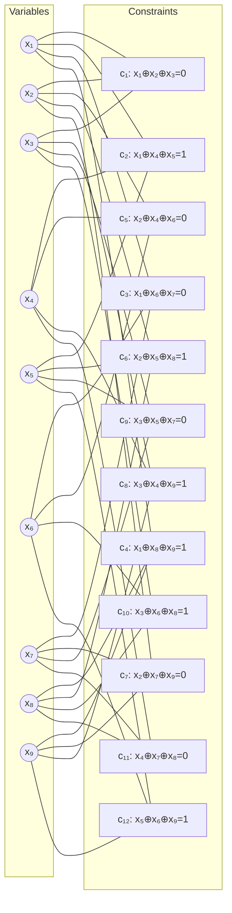
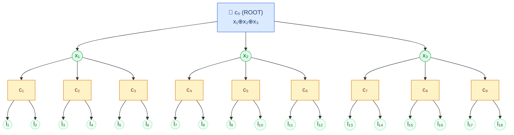
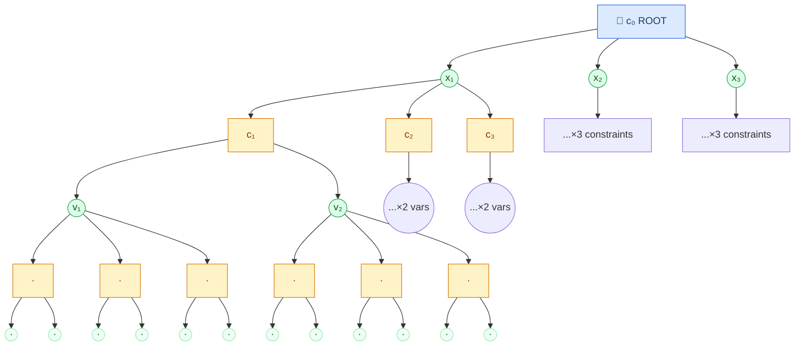
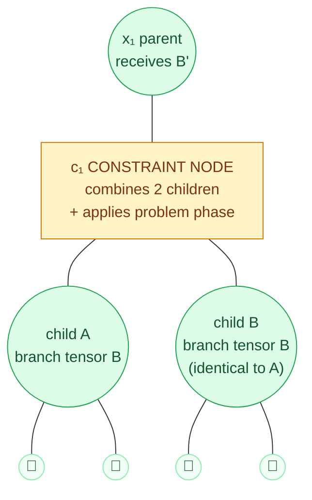
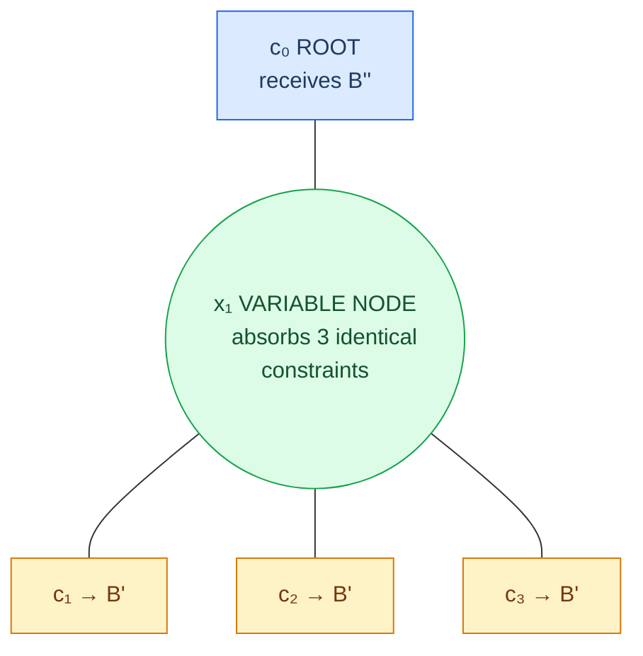
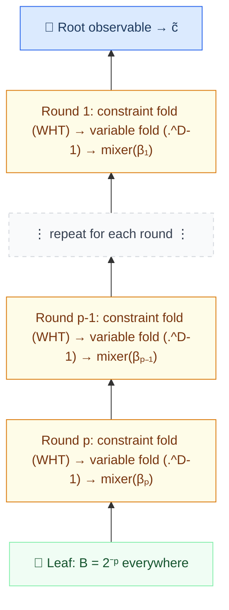
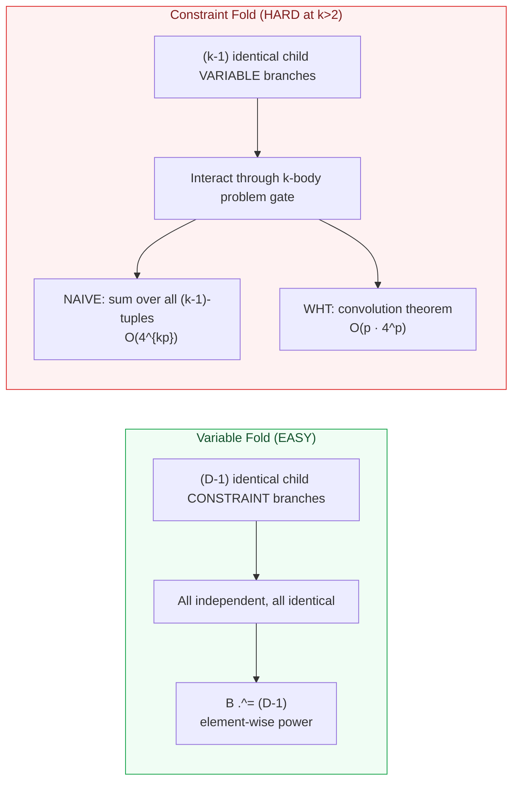
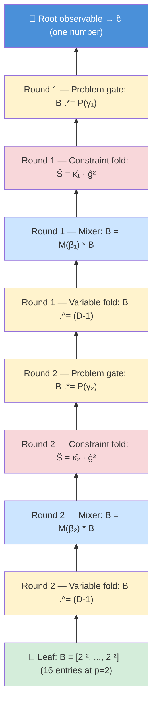

# QAOA-XORSAT Visual Walkthrough

> **Purpose**: Diagrams for explaining the (k=3, D=4) problem to Stephen Jordan.
> Covers the hypergraph structure, light-cone expansion, and the fold contraction.

---

## 1. A Minimal (k=3, D=4) Hypergraph Instance

Each variable participates in exactly D=4 constraints. Each constraint connects
exactly k=3 variables. With n=9 variables and m=12 constraints (since 3m = 4n):

**Key observations:**
- Every variable (circle) has exactly **4 edges** → D=4 regularity
- Every constraint (box) has exactly **3 edges** → k=3 uniformity
- Count: 9 variables × 4 = 36 edge-endpoints = 12 constraints × 3 ✓
- The target bits (0 or 1) on each constraint are arbitrary — on a tree they
  can be gauged away (Basso §8.1)
- This graph has **short cycles** (e.g., x₁→c₁→x₂→c₅→x₄→c₂→x₁, length 6).
  For QAOA analysis we need girth > 2p, so at large n the graph would be
  locally tree-like. The diagrams below show the *tree* that would appear
  as the local neighbourhood.

---

## 2. The Light Cone: What One Constraint Sees

### p=1: One round of twist-mix (21 qubits, 10 constraints)

The root constraint c₀ connects 3 variables. Each variable has 3 OTHER
constraints (D-1=3). Each of those constraints connects 2 OTHER variables
(k-1=2). Those are the leaves — the boundary qubits in |+⟩.

**Counts at p=1:**
| Level | Type | Count | Colour |
|-------|------|-------|--------|
| 0 | Root constraint | 1 | Light blue |
| 1 | Root variables (x₁,x₂,x₃) | k=3 | Light green |
| 2 | Child constraints | k(D-1) = 9 | Light amber |
| 3 | Leaf variables | k(D-1)(k-1) = 18 | Pale green |
| | **Total qubits** | **21** | |

### Why it's a tree

No variable appears twice. Each branch is **independent** — the subtree below
c₁ (containing l₁, l₂) shares no qubits with the subtree below c₂ (containing
l₃, l₄). This is because girth > 2p = 2 on the original graph.

### p=2: Two rounds (129 qubits, 64 constraints)

At p=2, each leaf variable from p=1 becomes an internal node, sprouting 3 more
child constraints, each with 2 more leaf variables. The tree grows by branching
factor b = (D-1)(k-1) = 6 per two-level step.

**Growth at p=2** (showing only c₁'s subtree; the full tree has 9 such subtrees):
| Level | Type | Count | Running total |
|-------|------|-------|---------------|
| 0 | Root constraint | 1 | 1 constraint |
| 1 | Root variables | 3 | 3 variables |
| 2 | Child constraints | 9 | 10 constraints |
| 3 | Internal variables | 18 | 21 variables |
| 4 | Grandchild constraints | 54 | 64 constraints |
| 5 | **Leaf variables** | **108** | **129 variables** |

**129 qubits at p=2.** Brute-force simulation would need 2¹²⁹ amplitudes — more
than atoms in the observable universe. But the fold needs only a 4² = 16 entry
branch tensor.

---

## 3. The Fold: Contracting from Leaves to Root

This diagram shows the fold for p=1, focusing on the path from leaves through
one child constraint (c₁) up to root variable x₁ and then the root observable.

**The key insight: every dotted box contains the SAME computation** (by symmetry).

### 3a. Zooming in: one constraint neighbourhood

The fold operates locally. Here's the view from inside **one constraint node**
(c₁) looking at its two child variable branches. This is the fundamental unit
of work — repeated at every constraint in the tree, but computed only once.

**What happens at c₁:**

Both children have produced the **same** branch tensor B (4ᵖ entries).
The constraint must combine them, weighted by the 3-body problem phase
(which couples parent × child A × child B):

| Step | Operation | What it does | Cost |
|------|-----------|-------------|------|
| 1 | $W = g \star g$ | Self-convolve children (WHT: $\hat{W} = \hat{g}^2$) | O(p · 4ᵖ) |
| 2 | $S = \kappa \star W$ | Convolve with cosine kernel (WHT: $\hat{S} = \hat{\kappa} \cdot \hat{W}$) | O(p · 4ᵖ) |
| 3 | $B'[a] = S[a]^D$ | Raise to Dth power (variable fold above) | O(4ᵖ) |

The combined result B' is passed up to x₁. That's one constraint fold + one
variable fold — one "level" of the tree absorbed into the branch tensor.

### 3b. Zooming in: one variable neighbourhood

Here's the view from inside **one variable node** (x₁) looking at its (D-1)=3
child constraints. Much simpler — no coupling.

**What happens at x₁:**

All three child constraints produced the **same** B'. Since they're independent:

| Step | Operation | What it does | Cost |
|------|-----------|-------------|------|
| 1 | $B'' = B'^{D-1}$ | Element-wise cube (3 identical, independent siblings) | O(4ᵖ) |
| 2 | $B'' = M(\beta) \cdot B''$ | Apply mixer for this round | O(4ᵖ) |

That's it. No triple loop, no WHT. Just power and multiply.

### 3c. The full fold pipeline (contracted)

Each round folds one constraint level + one variable level. The branch tensor
B flows upward, absorbing one twist-mix round at each step:

At every stage, only one vector of 4ᵖ entries exists. The tree (21 qubits at
p=1, 129 at p=2, billions at p=10) never materialises. The fold compresses
it all.

### Variable fold vs. Constraint fold — why one is hard

**Why the variable fold is easy:** At a variable node, the (D-1) child constraint
branches are independent and identical. Their combined contribution is just the
product: $B[σ]^{D-1}$ for each hyperindex entry. Element-wise power. Done.

**Why the constraint fold is hard (for k>2):** At a constraint node, the (k-1)
child variable branches interact through the k-body problem gate. The gate
evaluates $\cos(\Gamma \cdot (a \odot b^1 \odot b^2) / \sqrt{D})$, which
couples all children simultaneously. You can't just power one child's tensor.

**Why the WHT saves us:** The coupling has the form of a **convolution on
XOR-space**. The Walsh-Hadamard transform diagonalises this convolution,
reducing the cost from O(4^{kp}) to O(p · 4^p) — the same as the variable fold.

### The complete fold for p=2

At p=2, the fold has **two** rounds. Each round does one variable fold + one
constraint fold. The branch tensor is carried through both rounds:

The pattern is clear: **for each round p, p-1, ..., 1: variable fold → mixer →
constraint fold → problem gate. Then apply the root observable.** The branch
tensor B (16 entries at p=2, 4^p entries in general) is the only data structure
that passes between steps. The entire tree — with its 129 qubits and 64
constraints — has been compressed into this single vector.

---

## 4. Cost Summary

| Component | p=1 | p=5 | p=10 | p=15 |
|-----------|-----|-----|------|------|
| Light-cone qubits | 21 | 27,993 | ~6×10⁹ | ~10¹¹ |
| Branch tensor entries | 4 | 1,024 | ~10⁶ | ~10⁹ |
| Memory for branch tensor | 64 B | 16 KB | 16 MB | 16 GB |
| Cost per fold step (WHT) | ~40 ops | ~10⁴ | ~10⁷ | ~10¹⁰ |
| **Full evaluation** | instant | ms | seconds | hours |

The tree size grows as $6^p$ (exponential explosion). The branch tensor grows as
$4^p$ (still exponential, but much slower). The fold never materialises the tree —
it only ever holds the branch tensor.
