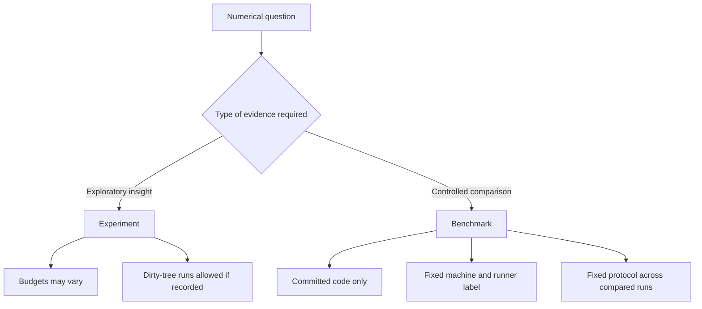
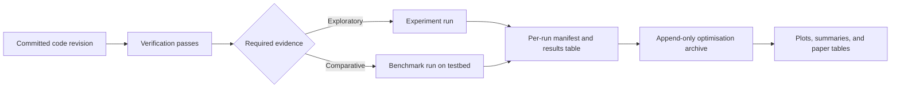

# Experimentation and Benchmarking Protocol

## Purpose

This document defines the methodological structure used to generate reported
numerical results for QAOA-XORSAT.

It is intended to be sufficiently formal to support inclusion, in adapted form,
within the project paper as the methodology used to obtain optimisation and
timing data.

The canonical operational policy remains
`.project/protocols/testing-benchmarking-policy.md`. The present document focuses on
methodological clarity: what kinds of runs are performed, what is held fixed,
what is allowed to vary, and how preserved results should be interpreted.

Reproduction is treated separately in
`.project/protocols/reproduction-protocol.md` because its goal is validation against
an external target rather than exploratory or comparative measurement.

## 1. Objectives

The protocol has three distinct objectives.

1. To support exploratory numerical investigation.
2. To support controlled performance comparison across code revisions.
3. To support defensible reporting of numerical values in internal reports and future papers.

## 2. Run Classes

### Experiment

An experiment is an exploratory run used to learn about behaviour.

An experiment may vary:

- optimiser budget
- seed policy
- depth range
- machine environment

An experiment may also originate from a dirty tree. Experiments are valuable,
but they are not benchmark-grade by default.

### Benchmark

A benchmark is a controlled comparative run used to support statements about
improvement or regression over time.

A benchmark must fix:

- code revision
- machine class
- runner label
- optimisation budget
- seed policy
- reporting schema

## 3. Evidence Model

The protocol distinguishes between exploratory and controlled evidence.

Exploratory results are useful for hypothesis generation, parameter discovery,
and triage. Controlled benchmark results are the basis for claims of improvement
or regression. The protocol therefore treats these run classes differently in
both execution and interpretation.

## 4. Standard Numerical Pipeline

The standard path from code revision to preserved numerical evidence is:

This document covers the experiment and benchmark branches of that pipeline.
The reproduction branch is specified separately.

## 5. Environment Requirements

### Experiments

Experiments may be run on:

- the development machine
- hosted infrastructure
- the dedicated testbed

However, the environment must still be recorded. Development-machine timings
are informative but not benchmark-grade.

### Benchmarks

Benchmarks must be run on the dedicated testbed.

The testbed environment is required because the protocol treats timing as a
measurement problem. Noise from unrelated system activity invalidates strict
comparisons.

## 6. Fixed and Variable Quantities

### For experiments

The following may vary intentionally:

- restart count
- iteration cap
- depth range
- seed policy
- local machine state

These variations are acceptable because the purpose is exploration rather than
fair cross-run comparison.

### For benchmarks

The following must remain fixed across compared runs:

- runner label
- machine class
- optimiser budget
- seed policy
- output schema
- interpretation rules

Only under those conditions can cross-run comparisons be treated as evidence of
improvement or regression.

## 7. Numerical Reporting Units

For the purposes of this protocol, each preserved run produces a per-depth
record containing, at minimum, optimisation quality and execution-cost fields.

The primary reported units are:

- expected satisfaction value
- wall-clock runtime
- evaluation count
- convergence state
- retry state where relevant

These units support both optimisation-quality analysis and runtime analysis.

## 8. Provenance Requirements

Every preserved run must record enough metadata to reconstruct the conditions of
the run.

Required fields include:

- `run_id`
- `run_kind`
- `timestamp_utc`
- `git_commit`
- `git_branch`
- `git_dirty`
- runner or machine label
- problem parameters and depth
- optimiser budget
- seed
- value
- wall-clock time
- evaluation count
- convergence information
- retry information where relevant

Without this metadata, numerical outputs are not methodologically defensible.

## 9. Reliability Capture

Benchmark-grade and reproduction-grade runs should preserve machine-state
artefacts before and after the heavy command.

This allows later review of:

- background load
- memory pressure
- swap activity
- thermal conditions
- power state

These artefacts are part of the protocol because timing results must be judged
in context.

## 10. Interpretation Rules

For fixed `(k, D, p)` under a fixed benchmark protocol:

- higher `value` indicates better optimisation quality
- lower `wall_time_seconds` indicates better runtime performance
- lower evaluation count at equal value indicates better optimiser efficiency

Experiment results may suggest hypotheses, but benchmark results are the proper
basis for comparative claims.

Dirty-tree experimental runs may be scientifically useful, but they should not
be presented as clean commit-to-commit benchmark evidence.

## 11. Use in Reporting

When reported in project documents or papers, numerical results should indicate:

- whether they came from experiment, benchmark, or reproduction runs
- what environment they were produced on
- what optimiser budget was used
- whether the underlying tree was clean or dirty

This distinction is necessary to prevent exploratory evidence from being
misrepresented as controlled measurement.

## 12. Relation to Other Documents

This document should be read together with:

- `.project/protocols/testing-benchmarking-policy.md`
- `.project/protocols/testing-protocol.md`
- `.project/protocols/reproduction-protocol.md`
- `.project/protocols/optimization-data-protocol.md`
- `.project/testing-register.md`
- `.project/runbooks/initial-qaoa-performance-sweep.md`
