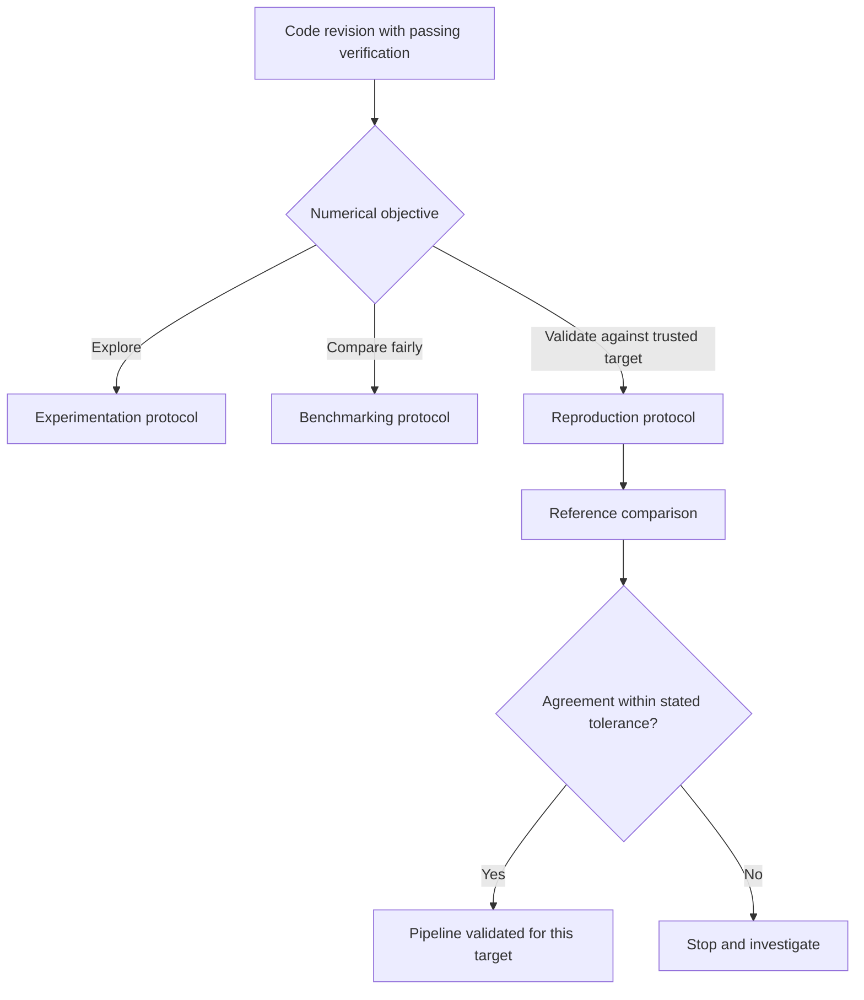

# Reproduction Protocol

## Purpose

This document specifies the protocol for deliberate reproduction runs.

Reproduction is treated separately from experimentation and benchmarking because
its purpose is not exploratory learning or internal regression tracking. Its
purpose is validation against an external or historically trusted target.

## 1. Objective

The objective of a reproduction run is to answer the following question:

> Can the current pipeline deliberately recover a trusted reference result under
> stated conditions?

In this project, the first reference targets are literature-backed MaxCut values
and other established comparison points used to validate the optimisation stack
before new project-specific claims are reported.

## 2. Position in the Testing Stack

## 3. Preconditions

Before a reproduction run is treated as evidence, the following conditions must
hold.

1. Ordinary verification must pass.
2. The code revision must be identifiable.
3. The target value or target table must be explicitly named.
4. The numerical tolerance must be stated.
5. The machine environment must be recorded.

Where timing forms part of the interpretation, reproduction runs should use the
same controlled environment as benchmark runs.

## 4. Standard Reproduction Sequence

The reproduction workflow should proceed in a fixed order.

The key point is that the target is stated before the run is interpreted. This
reduces retrospective fitting of the narrative to the numerical output.

## 5. What Must Be Fixed

For a reproduction claim to be meaningful, the following must be fixed or
explicitly stated:

- target problem instance or target family
- depth range
- optimiser budget
- seed policy
- machine environment
- comparison tolerance
- interpretation convention

If any of these vary between runs, the variation must be disclosed as part of
the protocol.

## 6. Acceptance Criterion

A reproduction is successful only if the observed result agrees with the stated
target within the stated tolerance under the stated protocol.

Success does not prove the entire pipeline correct in all settings, but it does
increase confidence that the implementation, conventions, and optimisation setup
are aligned for that class of target.

Failure is also informative. A failed reproduction should not be hidden; it
should trigger investigation of:

- implementation errors
- convention mismatches
- insufficient optimisation budget
- target misinterpretation
- environment instability

## 7. Provenance Requirements

Every preserved reproduction run should record:

- `run_kind = reproduce`
- the external target being checked
- the target value or table reference
- the comparison tolerance
- the observed value
- the code revision
- the machine label
- the optimiser budget
- the convergence and retry state

Without those fields, a reader cannot evaluate the strength of the reproduction claim.

## 8. Relation to Reported Results

The role of reproduction in the paper methodology is preparatory and justificatory.

It provides evidence that:

1. the implementation is capable of recovering trusted reference values
2. the chosen conventions are consistent with the comparison target
3. subsequent project-specific numerical claims are being made by a validated pipeline

Reproduction results should therefore be reported distinctly from exploratory
experiments and from benchmark regressions.

## 9. Relation to Other Documents

- `.project/protocols/testing-benchmarking-policy.md`
- `.project/protocols/testing-protocol.md`
- `.project/protocols/experimentation-benchmarking-protocol.md`
- `.project/protocols/optimization-data-protocol.md`
- `.project/testing-register.md`
