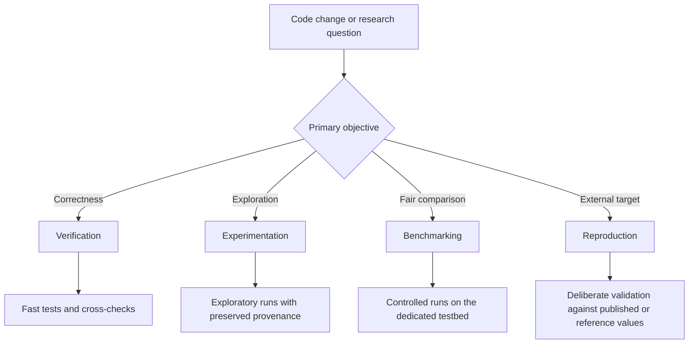
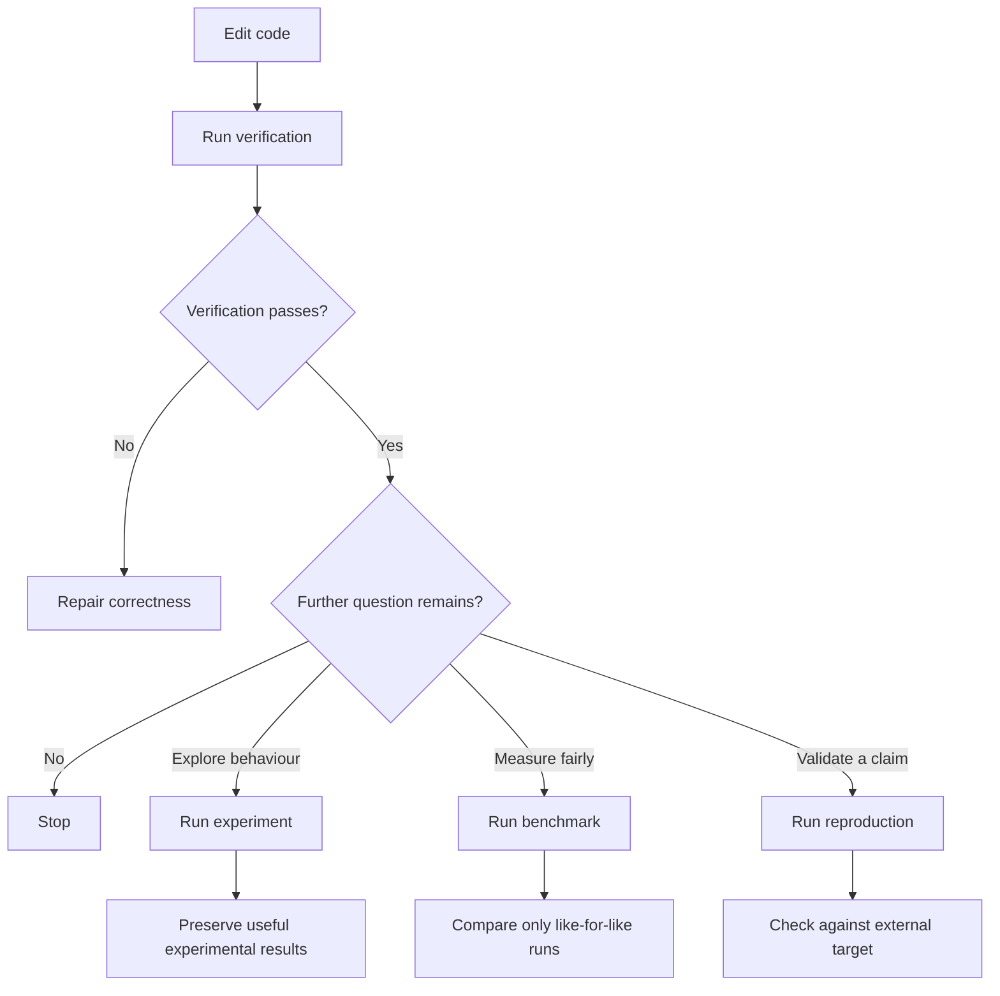
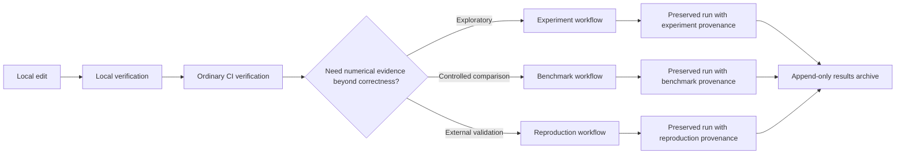

# Testing Protocol

## Purpose

This document describes the project testing protocol in a formal, readable form.

Its role is explanatory rather than normative. The canonical operational rules
remain in `.project/protocols/testing-benchmarking-policy.md`. The present document
explains how the pieces fit together, what question each kind of run answers,
and how a code change moves through the verification pipeline.

For the detailed inventory of current tests, see `.project/testing-register.md`.

## Scope

The testing protocol covers four distinct activities:

1. verification
2. experimentation
3. benchmarking
4. reproduction

These activities are related, but they are not interchangeable. They exist to
answer different questions and therefore require different workflows.

## Primary Classification

The first step is to classify the purpose of a run correctly.

## Definitions

### Verification

Verification answers the question:

> Does the code still work?

Verification is expected to be relatively cheap and frequent. It includes:

- unit tests for tree counts and tensor construction
- cross-validation between the Tier 1 exact simulator and Tier 2 finite-`D`
  evaluator
- property tests for invariants
- small published-value regressions that are cheap enough for normal CI

Verification should be the default response to ordinary code changes.

### Experimentation

Experimentation answers the question:

> Is a new idea worth pursuing?

Experimentation is exploratory. It is intended to generate information, not yet
to support final comparative claims. Typical examples include:

- trying new optimisation budgets
- evaluating warm-start heuristics
- probing deeper values of `p`
- comparing seed policies

Experimentation may be run on the development machine, may originate from a
dirty tree, and may vary budgets between runs. However, if results are kept,
their provenance must be recorded.

### Benchmarking

Benchmarking answers the question:

> Did a change improve or degrade performance under controlled conditions?

Benchmarking therefore requires control. A benchmark is meaningful only when
the principal conditions are held fixed, including:

- machine class
- runner label
- budget policy
- seed policy
- reporting schema

Benchmarking is a measurement activity, not merely a computational one. For
this reason, benchmark-grade runs belong on the dedicated testbed rather than
the development machine.

### Reproduction

Reproduction answers the question:

> Can the pipeline deliberately recover a trusted external or historical result?

Reproduction is used to establish credibility before new claims are made. For
example, reproducing known MaxCut values is stronger evidence than simply
observing internally consistent behaviour.

## Protocol Flow

In normal development, the activities above occur in a staged order.

## Development Lifecycle View

The project also needs a simple lifecycle diagram showing how a code change may
move from local development to preserved numerical evidence.

## Environment Roles

### Ordinary CI

Ordinary CI exists for verification only.

It should answer questions such as:

- do the tests pass?
- do the independent evaluators still agree?
- have known invariants been preserved?

It should not be overloaded with heavy optimisation sweeps or used as a source
of benchmark-grade timing claims.

### Development machine

The development machine is appropriate for:

- editing
- quick verification
- debugging failures
- small exploratory probes

It is not the canonical timing environment.

### Dedicated testbed

The dedicated testbed is the canonical environment for:

- controlled benchmarking
- deliberate reproductions
- heavier scheduled experiment sweeps
- timing-sensitive regression tracking

This separation exists to improve measurement quality as well as resource
availability.

## Result Preservation

Testing produces evidence only when the results remain interpretable later.
For that reason, preserved runs must carry provenance sufficient to answer
questions such as:

- which code produced this result?
- was the tree clean or dirty?
- was this an experiment or a benchmark?
- what optimiser budget was used?
- did the run converge or require retries?

This is why preservation records run metadata together with numerical output.

## Practical Use

The project should apply the following decision rule.

1. If the objective is confidence after a code change, run verification.
2. If the objective is exploration, run an experiment.
3. If the objective is a fair performance claim, run a benchmark.
4. If the objective is validation against the literature or a prior result, run reproduction.

## Common Failure Modes

The protocol is designed to prevent the following mistakes:

- treating noisy local timings as benchmark evidence
- mixing exploratory dirty-tree runs into controlled comparisons
- overloading ordinary CI with expensive sweeps
- preserving results without enough provenance to interpret later
- conflating explanatory documents with the canonical operational policy

## Related Documents

- `.project/protocols/testing-benchmarking-policy.md`
- `.project/protocols/experimentation-benchmarking-protocol.md`
- `.project/protocols/reproduction-protocol.md`
- `.project/testing-register.md`
- `.project/specs/property-tests.md`
- `.project/implementation-notes/testing-benchmarking-rollout.md`
- `.project/runbooks/testbed-runner-checklist.md`
