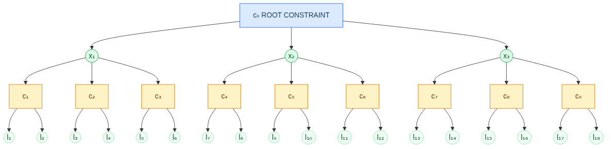
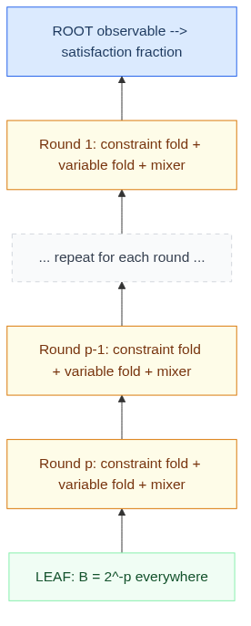
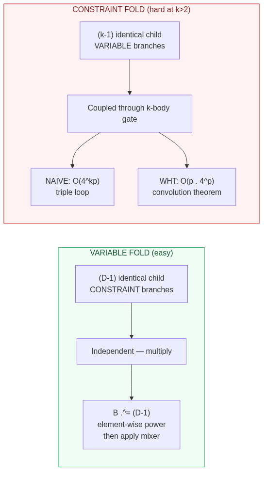
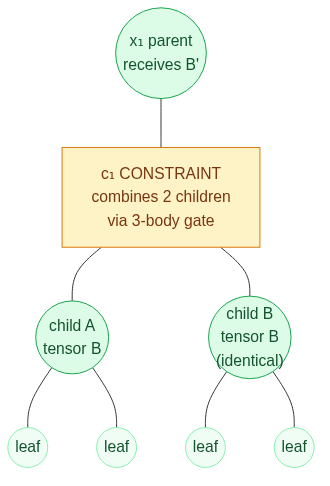

# QAOA on Max-k-XORSAT: Study Notes

*Notes prepared for a conversation with Dr. Stephen Jordan, March 2026.*

---

## The Problem

Stephen wants a number. Specifically: **what fraction of constraints can QAOA
satisfy on D-regular Max-k-XORSAT, at (k=3, D=4), as a function of circuit
depth p?**

He has a table. DQI+BP scores 0.871 at this point. Simulated annealing
manages 0.937. Regev+FGUM sits at 0.892. The QAOA column is empty.

That's what we're computing.

The comparison matters because QAOA and DQI are structurally different quantum
algorithms — they exploit different features of the problem. At (k=3, D=4),
DQI is in its unfavourable regime (random LDPC, weak decoders, blocked by OGP).
QAOA has no such known obstruction. The question is whether QAOA's interference
mechanism can exploit the structure that DQI cannot.

---

## What QAOA Actually Does

The circuit alternates two operations, p times:

1. **Problem phase** ($e^{-i\gamma C}$): each constraint applies a phase
   proportional to whether it's satisfied. Good assignments accumulate different
   phases than bad ones. Probabilities don't change — yet.

2. **Mixer** ($e^{-i\beta X}$): single-qubit rotations that cause neighbouring
   assignments (differing by one bit) to interfere. Constructive interference
   amplifies assignments in "good neighbourhoods"; destructive interference
   suppresses isolated outliers.

At depth p, the interference ripple propagates p hops along the constraint
graph. On a high-girth regular hypergraph, the p-hop neighbourhood of any
constraint is a tree — the **light cone**. By regularity, every constraint's
tree is isomorphic. Evaluate one tree, and you have the answer for all of them.

---

## The Light-Cone Tree for (k=3, D=4)

The tree alternates between constraint nodes (each connecting k=3 variables) and
variable nodes (each participating in D=4 constraints, of which D-1=3 are
children). The branching factor per two-level step is $(D-1)(k-1) = 6$.

At p=1, the tree has 21 qubits and 10 constraints:

Each branch is independent — no shared qubits between siblings. The subtree
below any child constraint is structurally identical to every other.

| Depth p | Qubits in tree | Naïve state-vector dimension |
|---------|---------------|------------------------------|
| 1       | 21            | $2^{21} \approx 2 \times 10^6$ — trivial |
| 2       | 129           | $2^{129}$ — more than atoms in the universe |
| 5       | 27,993        | absurd |

Direct simulation is out of the question beyond p=1.

---

## The Fold

The Farhi et al. tensor contraction (arXiv:2503.12789) is usually described in
the language of tensor networks — bond dimensions, contraction orderings,
element-wise exponentiation of branch tensors. That's all correct, but I think
there's a cleaner way to see what's happening.

**The computation is a structural fold (catamorphism) on the light-cone tree.**

The idea: define a "branch tensor" — a vector of $4^p$ entries — that summarises
everything a subtree contributes to its parent node. Start at the leaves, where
the branch tensor is trivial ($2^{-p}$ everywhere, because $|+\rangle$ is an
eigenstate of X). Then fold inward one level at a time. At each level, the
branch tensor absorbs one round of the QAOA circuit:

- **At a variable node**: the D-1 identical child constraint branches are
  independent, so their combined contribution is just an element-wise power:
  $B[\sigma]^{D-1}$. Then apply the mixer for this round.

- **At a constraint node**: the k-1 identical child variable branches interact
  through the k-body problem gate. This is a more involved combination — but
  still a well-defined function that takes the branch tensor from below and
  produces a branch tensor for above.

After p rounds of folding (one variable level + one constraint level per round),
the branch tensor arrives at the root. Apply the observable, get a number.

The tree — with its $6^p$ leaves and exponentially many qubits — never
materialises. The branch tensor is the only data structure. It is created at
the leaves, transformed at each level, and consumed at the root. A single
$4^p$-entry vector flows from bottom to top.

This is the same pattern as a fold over a list or a tree in functional
programming: a base case (the leaf tensor), an algebra (the per-level
transformation), and a carrier type (Vector of $4^p$ complex entries). The tree
structure determines the recursion shape; regularity collapses it to a single
representative path.

I find it revealing that different communities have independently arrived at the
same computation and given it different names:

| Community | What they call it |
|-----------|-------------------|
| Tensor networks | Contraction |
| Belief propagation | Message passing |
| Statistical physics | Transfer matrix / cavity method |
| Algorithms | Bottom-up dynamic programming |
| Functional programming | Fold / catamorphism |

It's the same thing. Coming from an FP background, I'd describe the Farhi et al.
tensor contraction as "a `foldr` on a regular tree where the algebra is
element-wise exponentiation composed with a matrix-vector multiply, and the
carrier type is `Vector{ComplexF64}` of length $4^p$." A physicist would call
that a transfer matrix recursion. Neither description is more correct — they're
the same computation viewed through different lenses. But the fold framing
makes the implementation structure obvious: it's a loop carrying a vector, with
one step per tree level.

For MaxCut, the cost is $O(p \cdot 4^p)$ per evaluation, independent of D.
Farhi et al. pushed this to p=17 on 3-regular graphs, reaching a cut fraction
of 0.8971.

---

## What Changes at k=3

The fold structure is the same. The tree is the same (just bushier). The mixer
is the same. What changes is the **constraint fold step**.

At a constraint node, the children interact through the k-body problem gate:

At k=2 (MaxCut), each non-root constraint connects one parent variable to one
child variable. The child's branch tensor passes straight through — nothing to
combine.

At k=3, each non-root constraint connects one parent variable to **two** child
variables. These two children interact through the 3-body problem gate, which
couples all three participants simultaneously. You can't just raise one child's
tensor to the $(k-1)$th power — the children's contributions are entangled
through the gate.

The naïve cost of this step is $O(4^{kp})$ — for k=3, that's $O(64^p)$.
Manageable at p=5 or so, but nowhere near p=17.

This is the Basso et al. finite-D iteration (arXiv:2110.14206, §8.2, Eq. 8.7).
It's exact at any D — no large-D approximation. But the cost is the bottleneck.

---

## The Convolution Structure

The constraint fold sum has the form:

$$S(\mathbf{a}) = \sum_{\mathbf{b}^1, \mathbf{b}^2}
\cos\!\left(\frac{\boldsymbol{\Gamma} \cdot
(\mathbf{a} \odot \mathbf{b}^1 \odot \mathbf{b}^2)}{\sqrt{D}}\right)
g(\mathbf{b}^1)\,g(\mathbf{b}^2)$$

where $\odot$ is entrywise multiplication on $\{-1,+1\}^{2p+1}$, and $g$ is the
branch tensor from below.

The structure of this sum — a kernel evaluated at the entrywise product $a \odot
b^1 \odot b^2$ — is a **double convolution on the group
$\mathbb{Z}_2^{2p+1}$**. That is, it decomposes into:

1. A **self-convolution** of $g$: grouping all pairs $(b^1, b^2)$ by their
   combined parity $c = b^1 \odot b^2$.
2. A **convolution** of the resulting sum with the cosine kernel.

Both operations are convolutions on the same finite abelian group. The
Walsh-Hadamard transform — the Fourier transform on $\mathbb{Z}_2^n$ —
diagonalises them. The entire constraint fold reduces to three WHTs and two
pointwise operations:

$$\hat{S} = \hat{\kappa} \cdot \hat{g}^2$$

Cost per step: $O(p \cdot 4^p)$. The same scaling as the variable fold. The
same scaling as MaxCut.

I should note that this factorisation is not stated explicitly in the
literature — Basso et al. quote $O(4^{kp})$ for the finite-D iteration, and
the Villalonga reference implementation handles only the $D \to \infty$ regime.
I'm currently verifying the WHT approach numerically, and early results at
p=1,2,3 show agreement to machine precision.

If it holds up — and the algebraic argument via the convolution theorem suggests
it should — this extends exact finite-D computation for k=3 from p≈7 to p≈17
on commodity hardware.

---

## Validation Strategy

Three tiers of validation, each checking the next:

1. **Brute-force statevector simulation** (p=1 for k=3,D=4; p=1,2 for MaxCut).
   Explicitly builds the light-cone tree, stores all $2^n$ amplitudes, applies
   every gate. Provably correct. Already reproduces the known MaxCut p=1 result:
   $\tilde{c} = \tfrac{1}{2} + \tfrac{\sqrt{3}}{9} \approx 0.6924$.

2. **Basso finite-D iteration** cross-validated against brute force at
   overlapping p values. Exact agreement required.

3. **Farhi 2025 Table 1** for MaxCut at p=5,7,17. These are published values;
   our code must reproduce them.

---

## Computational Resources

| Machine               | RAM    | Comfortable max p | Cost       |
|-----------------------|--------|-------------------|------------|
| M4 Max Mac Studio     | 64 GB  | p=14              | On hand    |
| Dual Xeon workstation | 128 GB | p=15              | On hand    |
| Azure E96-24ds v6     | 768 GB | p=17              | ~$8/hr     |
| Azure FX96-48ms v2    | 1.8 TB | p=18              | ~$11/hr    |

The branch tensor at depth p has $4^p$ complex entries × 16 bytes. At p=15 that's
16 GB; at p=17, 256 GB. The tree size ($\sim 6^p$ qubits) never materialises.

---

## Open Questions for Discussion

1. **Is p ≈ 15 sufficient depth for a meaningful comparison?** The MaxCut data
   shows diminishing returns beyond p=10. If the k=3 curve behaves similarly,
   the trend should be clear well before p=17.

2. **Interest in the WHT factorisation?** If confirmed, this is — as far as I
   can tell — a novel algorithmic contribution. The reduction from $O(4^{kp})$ to
   $O(p \cdot 4^p)$ for the exact finite-D iteration at arbitrary k would be
   worth documenting independently of the numerical results.

3. **Other (k, D) values?** The code is parameterised by (k, D, p) from the
   start. Once (3, 4) is computed, extending to other rows of the comparison
   table is straightforward.
